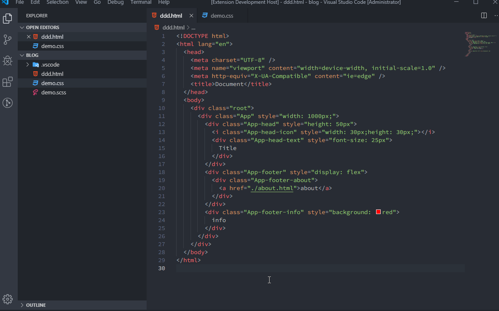
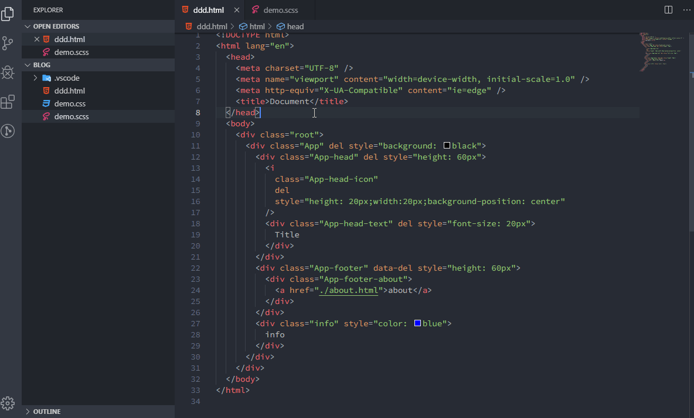

# get-style-from-html README

Extract styles from html, support sass and css, now only need to write css class once in html.

## Features

- Before using `Get style from html`: write a class in `html`, and also write a corresponding class in `css`.
- After using `Get style from html`: write a class in `html` and write inline style, then `Get style from html` can get the `class` and `style` of the tag, and then synthesize `sass` or `css` code, write a lot less css classes.

## Examples

### Example sass

### Example css

### Example delete style by "data-del" or "del"

## Extension Settings

This extension contributes the following settings:

- `get.style.from.html.cssStyle`: `sass` or `css`

## Release Notes

### 1.0.2

New feature: Add `del` or `data-del` in front of style. Using Get style from html command will remove the code `style="XXX"`.
New feature: Hot key `alt+shift+q`.

### 1.0.1

New feature: sass deep nesting.

### 1.0.0

Initial release of get-style-from-html.
